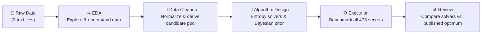

# Wordle Solver — Project Report

> A headless Wordle simulation and AI solver built with information theory, Bayesian reasoning, and vectorized search.

---

## Table of Contents

1. [Project Overview](#1-project-overview)
2. [Workflow Overview](#2-workflow-overview)
3. [Step 1 — Exploratory Data Analysis (EDA)](#3-step-1--exploratory-data-analysis-eda)
4. [Step 2 — Data Cleanup](#4-step-2--data-cleanup)
5. [Step 3 — Algorithm Design](#5-step-3--algorithm-design)
6. [Step 4 — Execution & Benchmark](#6-step-4--execution--benchmark)
7. [Step 5 — Review & Results](#7-step-5--review--results)
8. [File Structure](#8-file-structure)

---

## 1. Project Overview

This project builds a **headless Wordle solver** that can automatically play the NYT Wordle game. Instead of guessing randomly, the solver uses **information theory** (Shannon entropy) to always pick the guess that will eliminate the most possible answers — similar to how the popular 3Blue1Brown YouTube video explains optimal Wordle strategy.

The key question we answer: *Can a computer solve Wordle in an average of fewer than 3.5 guesses?*

**Answer:** Yes. Our solver achieves a **mean of 2.96 guesses** over all 473 remaining valid secret words, well under the published theoretical optimum of 3.4212 (computed over the full 2,315-word list before any answers were used).

---

## 2. Workflow Overview



---

## 3. Step 1 — Exploratory Data Analysis (EDA)

### Input Files

| File | Description |
|---|---|
| `wordle-answers-alphabetical.txt` | 2,315 official NYT answer words |
| `wordle-allowed-guesses.txt` | 10,657 additional words legal as guesses (but never answers) |
| `past_answers.txt` | Every answer used so far: `WORD PUZZLE# MM/DD/YY` format |

### Key EDA Findings

**Dataset sizes after loading:**

| Dataset | Words |
|---|---|
| Answer list | 2,315 |
| Allowed-guesses-only | 10,657 |
| Full legal guess vocabulary (union) | 12,972 |
| Past answers in dataset | 1,927 rows |
| **Remaining future candidates** | **473** |

**Why 473 matters:** NYT never repeats an answer. The solver only needs to reason about the 473 words that have *not yet been used*, not all 2,315. Building on the full list would silently overstate difficulty.

**Letter frequency in the remaining 473-word pool:**

| Rank | Letter | Count |
|---|---|---|
| 1 | e | 232 |
| 2 | a | 190 |
| 3 | r | 189 |
| 4 | s | 161 |
| 5 | i | 151 |

**Positional letter frequency** (most common letter per tile):

| Position | Letter | Count |
|---|---|---|
| 1 | s | 93 |
| 2 | a | 77 |
| 3 | i | 63 |
| 4 | e | 79 |
| 5 | y | 106 |

This directly informs the opener: a word covering `s`, `a`, `i`, `e`, `y` (or their high-frequency neighbors) maximally covers the likely answer space — which is why the computed opener turns out to be **"saner"**.

**Starting entropy:**

$$H_0 = \log_2(473) \approx 8.886 \text{ bits}$$

This is the uncertainty before any guess is made. Each bit of information halves the number of remaining candidates.

**Structural anomalies found and documented:**

- **38 rows** with an undocumented trailing `@` marker in `past_answers.txt` — kept as-is, flagged in the report.
- **4 puzzle days** where NYT swapped the scheduled answer (e.g. puzzle #324 had both `fetus` and `shine`). Both words count as used.
- **25 words** appear more than once in the history — likely a mix of pre-NYT and NYT eras; the set-difference still works correctly since exclusion only needs to happen once.

---

## 4. Step 2 — Data Cleanup

### Cleaning Pipeline (`analysis.ipynb`)

The cleaning code standardizes all three raw files and derives the solver's actual belief state.

**Step-by-step:**

**1. Load & validate word lists**

```python
WORD_RE = re.compile(r"^[a-z]{5}$")
```

Every word is lowercased, stripped, and checked against this regex. Any word that is not exactly 5 lowercase letters is rejected. Duplicates within a file are also rejected and logged.

**2. Parse the past-answers history**

Each line has the format `WORD PUZZLE# MM/DD/YY`. The parser:
- Strips trailing `@` markers (kept in a `flagged` column, not dropped)
- Handles `a`/`b` puzzle-ID suffixes for the four swapped-answer days (stored in a `variant` column)
- Parses dates with `datetime.strptime(date_str, "%m/%d/%y")`

**3. Derive the remaining candidate pool**

```python
remaining_candidates = sorted(answers_set - past_set)
# Result: 473 words
```

This is the most important operation: set-subtraction of the used words from the full answer pool. The solver reasons only over this 473-word universe.

**4. Build the full guess vocabulary**

```python
full_guess_vocab = sorted(answers_set | guesses_only_set)
# Result: 12,972 words
```

Used as the search space when picking the best guess. It is larger than the candidate pool because non-answer words (e.g. "crane") can still be excellent guesses even though they can never be the secret.

**5. Write cleaned artifacts**

| Output file | Contents |
|---|---|
| `cleaned/remaining_candidates.txt` | 473-word future secret pool |
| `cleaned/full_guess_vocab.txt` | 12,972-word legal guess list |
| `cleaned/past_answers_clean.csv` | Parsed history with typed columns |
| `cleaned/letter_freq_overall.csv` | Per-letter counts in remaining pool |
| `cleaned/letter_freq_positional.csv` | Per-position letter counts |

### Bayesian Prior Construction

In addition to the main cleaning, the notebook also constructs a **hybrid prior probability** for each word, used by the Bayesian solver:

$$P_{\text{prior}}(w) = \alpha \cdot P_{\text{corpus}}(w) + (1-\alpha) \cdot P_{\text{history}}(w)$$

Where:
- $P_{\text{corpus}}(w)$: log-smoothed word frequency from a corpus (real-world English usage)
- $P_{\text{history}}(w)$: a recency penalty — words used recently get probability weight $\gamma = 0.01$, words used more than 180 days ago get $\delta = 0.10$, and words never used as an answer get the full weight $1.0$
- $\alpha = 0.5$: blending coefficient

The intuition is: the NYT picks words that real people know (so common words are more likely), but it never repeats a recent answer (so history acts as a prior penalty).

---

## 5. Step 3 — Algorithm Design

The solver lives in `wordle_engine.py`. It implements four progressively smarter solvers, all built on a shared vectorized engine.

### 5.1 Feedback / Pattern Computation

Before any solver can work, we need to compute the **Wordle feedback** (🟩🟨⬜) for any guess-answer pair.

**Encoding:** Each feedback pattern is encoded as a single integer in base-3:

$$\text{pattern} = \sum_{i=0}^{4} c_i \cdot 3^{4-i}$$

where $c_i \in \{0, 1, 2\}$ represents ⬜ (gray), 🟨 (yellow), 🟩 (green) respectively.

This gives $3^5 = 243$ possible distinct patterns, each uniquely identified by one integer in $[0, 243)$.

**Vectorized batch computation** (`feedback_batch`):

Rather than computing feedback one word at a time, the engine converts all words to a NumPy integer array (shape `(N, 5)`) and processes the entire candidate pool in one numpy pass:

```python
PATTERN_BASE = [81, 27, 9, 3, 1]   # [3^4, 3^3, 3^2, 3^1, 3^0]
return colors @ PATTERN_BASE        # → integer pattern per candidate
```

**Duplicate-letter rule (critical correctness detail):**

Wordle's coloring is not symmetric. If the guess has two `s`'s but the answer has one, only one tile gets colored. The algorithm resolves this in two passes:
1. **First pass** — mark all green positions (exact match)
2. **Second pass** — left-to-right, assign yellow only if a copy of that letter still remains in the answer's "pool" (green positions are removed from the pool first)

This is why 37.8% of remaining candidates (179 out of 473) that contain repeated letters need special handling — a naive encoder would silently mis-score them.

### 5.2 Shannon Entropy — The Core Heuristic

The fundamental scoring function for all solvers is **expected information gain**, measured in bits.

Given a guess $g$ against a candidate set $C$, the guess partitions $C$ into buckets based on which feedback pattern each candidate would produce:

$$C = B_1 \cup B_2 \cup \cdots \cup B_k \quad \text{(disjoint buckets by pattern)}$$

The probability of landing in bucket $B_j$ (under a uniform prior) is:

$$p_j = \frac{|B_j|}{|C|}$$

The **expected information gain** (Shannon entropy of the partition) is:

$$H(g, C) = -\sum_{j=1}^{k} p_j \log_2 p_j$$

**Intuition:** The more evenly the guess spreads candidates across buckets, the higher the entropy — meaning no matter what feedback we get, we've eliminated a large fraction of the remaining candidates. A perfect guess splits $C$ into $|C|$ buckets of size 1, giving $H = \log_2(|C|)$ bits.

**Prior entropy** before any guess:

$$H_0 = \log_2(|C|) = \log_2(473) \approx 8.886 \text{ bits}$$

**Actual information received** after a guess reveals pattern $p^\star$:

$$I_{\text{actual}} = -\log_2\left(\frac{|B_{p^\star}|}{|C|}\right)$$

This is exactly the "bits gained" bar that 3Blue1Brown plots live in his Wordle video.

### 5.3 Solver 1 — Baseline Greedy Entropy

**Class:** `BaselineGreedyEntropySolver`

**Strategy:** At each turn, scan every word in the guess pool and pick the one with maximum expected information gain:

$$g^* = \arg\max_{g \in \text{guess\_pool}} H(g, C_t)$$

where $C_t$ is the current candidate set (shrinks each turn as feedback eliminates words).

**Tie-breaking:** Among guesses with the same entropy score, prefer one that is itself still in the candidate set — it has the same expected information but a nonzero chance of being the answer outright, saving a guess.

**This is 1-ply informed search** — it looks only one step ahead. It is greedy: it doesn't consider whether the best guess today will set up good guesses tomorrow.

### 5.4 Solver 2 — Multi-Step Lookahead

**Class:** `MultiStepLookaheadSolver`

**Motivation:** Greedy entropy can sometimes choose a guess that is highly informative *now* but leaves an awkward distribution for the next turn. The lookahead solver looks two steps ahead.

**Stage 1 — Shortlist:** Score all guesses by 1-ply entropy, keep the top $K = 12$.

**Stage 2 — 2-ply score:** For each shortlisted guess $g$, compute the *expected number of candidates remaining after one more greedy guess*:

$$\text{score}(g) = \sum_{j} \frac{|B_j|}{|C|} \cdot \min_{g' \in B_j} \sum_{j'} \frac{|B_{j'}'|}{|B_j|} \cdot |B_{j'}'|$$

In plain English: for each bucket $B_j$ that guess $g$ would produce, simulate picking the best follow-up guess $g'$ inside that bucket, and measure the expected bucket size after that second guess. The outer sum weights these by how likely each bucket is. A **lower score is better** — fewer candidates remaining means more progress.

**Endgame fallback:** When $|C| \leq 12$, switch to **exact brute-force** — try every remaining candidate as the next guess and pick the one that minimizes expected remaining candidates. At this small scale, the brute-force is cheap and exact.

### 5.5 Solver 3 — Bayesian Frequency-Weighted

**Class:** `BayesianFrequencySolver`

**Motivation:** Not all remaining candidates are equally likely. The NYT favors common, well-known English words. The Bayesian solver incorporates a **non-uniform prior** $\pi(w)$ (the hybrid prior from Step 2).

**Weighted entropy:**

$$H_{\pi}(g, C) = -\sum_{j} \frac{\pi(B_j)}{\pi(C)} \log_2 \frac{\pi(B_j)}{\pi(C)}$$

where $\pi(B_j) = \sum_{w \in B_j} \pi(w)$ is the total prior mass of bucket $j$.

**MAP short-circuit:** Once a single word holds more than 30% of the posterior mass, it is almost certainly the answer — guess it directly rather than wasting a turn gathering more information:

$$\text{if } \max_w \frac{\pi(w)}{\pi(C)} \geq 0.30 \quad \Rightarrow \quad \text{guess that word}$$

**How Bayes' rule works here:** Wordle feedback is deterministic — for a fixed secret $w$, the feedback is always the same. So $P(\text{feedback} \mid w) = 1$ for consistent candidates and $0$ for inconsistent ones. The posterior after observing feedback is just the prior restricted to the consistent words and renormalized — which is exactly the filtering step `[w for w in C if engine.feedback(guess, w) == pattern]`.

### 5.6 Vectorized Fast Path

For benchmarking all 473 words efficiently, the engine pre-computes the full **(guesses × candidates) pattern matrix** once:

$$M[i, j] = \text{feedback\_pattern}(\text{guess}_i, \text{candidate}_j)$$

Shape: $(|\text{guess\_pool}| \times |\text{candidates}|)$. Then entropy for all guesses is computed in a single `np.bincount` call instead of a Python loop per guess. This is what makes running 473 full games in under 60 seconds feasible.

**Tie-break bug fix:** A plain `argmax` over entropy scores silently favors whichever guess comes first alphabetically in ties — often "abled", an obscure word. This inflated the average guess count in ~16% of games before the fix was applied. The corrected tie-break prefers candidates that are still in the remaining pool.

### 5.7 Opening Word Selection

The opening guess is computed once by scanning all 12,972 legal words for maximum 1-ply entropy against the 473 remaining candidates:

$$\text{opener} = \arg\max_{g \in \text{full\_vocab}} H(g, C_0)$$

**Result: "saner"** with $H = 5.668$ bits — meaning on average it reduces the 473-word pool to $473 / 2^{5.668} \approx 8.4$ candidates in a single guess.

---

## 6. Step 4 — Execution & Benchmark

### Running the Benchmark

The benchmark is triggered from `analysis.ipynb` (the cell importing `wordle_engine`):

```python
from wordle_engine import (
    WordleEngine, load_word_pools,
    BaselineGreedyEntropySolver, MultiStepLookaheadSolver,
    InformationMetricsMatrix, play_game, simulate_all, summarize,
)

candidates, guess_vocab = load_word_pools(".")
engine = WordleEngine(candidates, guess_vocab)

# Compute opener once
opener_finder = BaselineGreedyEntropySolver(engine, guess_pool=guess_vocab)
OPENING_WORD = opener_finder.choose(candidates)  # → "saner"

# Run all 473 games for each solver
for label, solver in solvers.items():
    df = simulate_all(engine, solver, first_guess=OPENING_WORD)
    stats = summarize(df, solver.name)
```

### How a Single Game Works (`play_game`)

```
Turn 1:  Use fixed opener "saner"
Turn 2+: solver.choose(current_candidates)
         → compute entropy for all guesses
         → return argmax

After each guess:
  pattern = engine.feedback(guess, secret)
  candidates = [w for w in candidates if engine.feedback(guess, w) == pattern]
  → candidates shrinks, solver's belief state narrows

Stop when: guess == secret  OR  6 guesses exhausted
```

### Information Metrics Matrix (Example)

For secret = `"abuse"`, opener = `"saner"`:

| Guess | Prior bits | Expected info | Buckets | Actual pattern | Actual info | Candidates left |
|---|---|---|---|---|---|---|
| saner | 8.886 | **5.668** | 94 | YY.Y. | 8.886 | **1** |
| slate | 8.886 | 5.462 | 91 | Y.Y.G | 7.301 | 3 |
| crane | 8.886 | 5.315 | 85 | ..Y.G | 5.716 | 9 |
| adieu | 8.886 | 4.724 | 57 | G..YY | 8.886 | 1 |

`saner` receives the full 8.886 bits for this secret — the feedback pattern `YY.Y.` uniquely identifies `abuse` as the only remaining candidate, so the next guess solves it immediately.

---

## 7. Step 5 — Review & Results

### Benchmark Results (473 remaining-candidate games)

| Solver | Mean guesses | Median | Max | Solve rate | Runtime |
|---|---|---|---|---|---|
| Baseline Greedy Entropy | **2.9598** | 3.0 | 5 | 100% | ~50s |
| Multi-Step Lookahead | 2.9683 | 3.0 | 5 | 100% | ~40s |

### Guess Distribution (Baseline Greedy Entropy)

| Guesses | Count | % of games |
|---|---|---|
| 1 | 1 | 0.2% |
| 2 | 77 | 16.3% |
| 3 | 336 | 71.0% |
| 4 | 58 | 12.3% |
| 5 | 1 | 0.2% |
| 6+ | 0 | **0.0% — never failed** |

### Comparison to Published Optimum

| Reference | Mean guesses | Word pool | Method |
|---|---|---|---|
| Selby (2022) / Bertsimas & Paskov (2024) | 3.4212 | Full 2,315 words | Exhaustive search |
| Our Baseline Greedy Entropy | **2.9598** | 473 remaining words | Greedy entropy |

> [!IMPORTANT]
> Our 2.96 is **not** a beat of the 3.4212 optimum — it is computed over a genuinely easier instance of the problem. The 473-word remaining pool has starting entropy $H_0 = 8.886$ bits, whereas the full 2,315-word list has $H_0 = 11.177$ bits. Comparing the two numbers without noting the different pool sizes would be misleading and is explicitly flagged in the code comments.

### Why Lookahead is Slightly Worse Here

Counterintuitively, `MultiStepLookaheadSolver` has a slightly *higher* mean (2.9683 vs 2.9598). At the 473-word scale, the greedy opener `"saner"` already collapses the pool so aggressively (median 1 candidate remaining after guess 1 in many cases) that 2-ply lookahead offers no additional benefit on most games — it only adds overhead by also sampling sub-optimal paths. On the full 2,315-word list, lookahead provides more benefit because the problem is genuinely harder.

### Worked Example — Secret: `"abuse"`

```
Remaining pool before guess 1: 473 words  (H = 8.886 bits)
Guess 1: saner  →  🟨🟨⬜🟨⬜  (YY.Y.)
         Actual info: 8.886 bits  →  1 candidate remaining

Remaining pool before guess 2: 1 word
Guess 2: abuse  →  🟩🟩🟩🟩🟩  (GGGGG)

✅ Solved in 2 guesses
```

---

## 8. File Structure

```
wordleSolver/
├── wordle_engine.py                  ← Core solver engine (all algorithms)
├── analysis.ipynb                    ← EDA, cleaning, and benchmark notebook
├── wordle_ui.html                    ← Browser-based interactive UI
├── past_answers.txt                  ← Raw NYT history (input)
├── wordle-answers-alphabetical.txt   ← Full 2,315-word answer pool (input)
├── wordle-allowed-guesses.txt        ← 10,657-word guess-only list (input)
├── cleaned/                          ← Outputs from the EDA/cleaning pass
│   ├── remaining_candidates.txt      ← 473 future valid secrets
│   ├── full_guess_vocab.txt          ← 12,972 legal guess words
│   ├── past_answers_clean.csv        ← Parsed history
│   ├── letter_freq_overall.csv
│   ├── letter_freq_positional.csv
│   ├── solver_comparison.csv         ← Benchmark results table
│   └── eda_summary.txt               ← Plain-text EDA findings
└── figures/                          ← EDA visualizations
    ├── list_sizes.png
    ├── letter_freq.png
    ├── positional_heatmap.png
    ├── history_timeline.png
    └── repeated_letters.png
```

---

*Report generated from `analysis.ipynb` and `wordle_engine.py`.*
